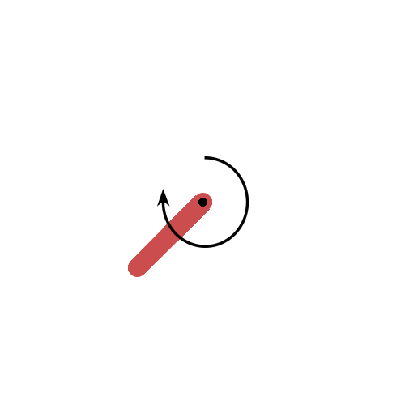

# PPO simple implementation :rocket:

[](https://opensource.org/licenses/MIT)

## What is this?

This is a simple implementation of PPO (Proximal Policy Optimization) algorithm.
The code is based on [OpenAI paper](https://arxiv.org/pdf/1707.06347.pdf).

## How to use

There are two different PPO : Continuous and Discrete.

### Continuous PPO

Continuous PPO is used for continuous action space (like BipedalWalker-v2 environement).
It handles MultiActions (like BipedalWalker-v2 environement).


### Discrete PPO

Discrete PPO is used for discrete action space (like LunarLander-v2 environement).
It doesn't handle MultiDiscrete action space.


Both discrete and continuous PPO have a recurrent support, using LSTM.

Just specify it in the arguments when you launch the script.

For the moment, MultiDiscrete  is not implemented (I'm working on it).

## Install requirements

```bash
pip install -r requirements.txt
```

## Launch the training

To run the training:

```bash
python train.py --args
```
## Launch the evaluation

To run the evaluation:

```bash
python eval.py --args
```

## Launch Tensorboard

To run Tensorboard:

```bash
tensorboard --logdir tensorboard_logs
```

### Arguments
It takes several arguments:

| Name                      | Description                                                           | Default                                |
|---------------------------|-----------------------------------------------------------------------|----------------------------------------|
| Continuous_or_Discrete    | "Continuous" or "Discrete" environment.                               | "Continuous"                           |
| recurrent                 | "True" or "False" (if you want to use a recurrent neural network).    | "False"                                |
| env_name                  | "LunarLander-v2", "BipedalWalker-v2" or "DoomBasic-v0".               | "LunarLander-v2"                       |
| actor_hidden_size         | Size of the hidden layer of the actor, and the activation function.   | {"layer" : [32,32],"activ" : ["relu"]} |
| critic_hidden_size        | Size of the hidden layer of the critic, and the activation function.  | {"layer" : [32,32],"activ" : ["relu"]} |
| lr                        | Learning rate.                                                        | 0.0003                                 |
| gamma                     | Discount factor.                                                      | 0.99                                   |
| K_epochs                  | Number of epochs of gradient descent.                                 | 4                                      |
| eps_clip                  | Clip parameter for PPO.                                               | 0.2                                    |
| mini_batch_size           | Size of the batch for gradient descent.                               | 64                                     |
| entropy_coef              | Entropy coefficient.                                                  | 0.01                                   |
| value_loss_coef           | Value loss coefficient.                                               | 0.5                                    |
| max_timesteps_one_episode | Maximum number of timesteps in one episode.                           | 2048                                   |
| timestep_per_update       | Number of timesteps before updating the policy.                       | 2048*4                                 |
| decay_rate                | Decay rate for the learning rate.                                     | 0.99                                   |
| render                    | "True" or "False" (if you want to render the environment).            | "False"                                |
| save_frequency            | Number of updates before saving the model.                            | 10                                     |
| shapley_values            | "True" or "False" (if you want to compute the shapley values).        | "False"                                |
| class_name                | Name of the classes (i.e actions) to compute the Shapley values.      | "[]"                                   |
| features_name             | Name of the features (i.e states) to compute the Shapley values.      | "[]"                                   |
| record_video              | "True" or "False" (if you want to record a video of the environment). | "False"                                |

Example for training :
```bash
python train.py --Continous_or_Discrete "Discrete" --recurrent "False" --env_name "LunarLander-v2" --actor_hidden_size '{"layer" : [32,32],"activ" : ["relu"]}' --critic_hidden_size '{"layer" : [32,32],"activ" : ["relu"]}' --lr 0.0003 --gamma 0.99 --K_epochs 4 --eps_clip 0.2 --mini_batch_size 64 --entropy_coef 0.01 --value_loss_coef 0.5 --max_timesteps_one_episode 2048 --timestep_per_update 2048 --decay_rate 0.99 --render "False"
```
Then, for testing :
```bash
python eval.py --Continous_or_Discrete "Discrete" --recurrent "False" --env_name "LunarLander-v2" --actor_hidden_size '{"layer" : [32,32],"activ" : ["relu"]}' --critic_hidden_size '{"layer" : [32,32],"activ" : ["relu"]}' --lr 0.0003 --gamma 0.99 --K_epochs 4 --eps_clip 0.2 --mini_batch_size 64 --entropy_coef 0.01 --value_loss_coef 0.5 --max_timesteps_one_episode 2048 --timestep_per_update 2048  --render "True"
```


### Choose the architecture of the neural networks

You can customize the architecture of the neural networks using argements **actor_hidden_size** and **critic_hidden_size**.

You have to specify the size of the hidden layers and the activation function in a dictionnary, with the following format:
```python
{
    "layer" : [32,32,64,...,64],
    "activ" : ["relu","relu",...,"relu"]
}
```
If you choose only one activation function, it will be applied to all the hidden layers.
It works for both actor and critic, and for both continuous and discrete PPO (even for the recurrent PPO).


## Action Masking

Action masking is used to prevent the agent from choosing an action that is not allowed by the environement.
To use it, you have to write the get_mask method in AbstractPPO class. For the moment, it is only implemented for the Discrete PPO.
The mask should have the same shape as the action space of the environement. It should be a boolean array, with True for allowed actions and False for forbidden actions (True are 1 and False are 0).
Thus, the agent will only choose actions with a True value in the mask.

## Results


### LunarLander-v2 (Discrete)

Here are the results for LunarLander-v2 environement (reward per episode):

| Rewards                                              | Video                                      |
|------------------------------------------------------|--------------------------------------------|
|  |  |


### BipedalWalker-v2 (Continuous)

Here are the results for BipedalWalker-v2 environement (reward per episode):

| Rewards                                              | Video                                               |
|------------------------------------------------------|-----------------------------------------------------|
|  |  |


### Pendulum-v1 (Continuous)

Here are the results for Pendulum-v1 environement:



### Fibonacci sequence (Discrete LSTM)

Here are the results for Fibonacci sequence (reward per episode):

| Rewards                                                    |                                           
|------------------------------------------------------------|
|  |

### Fibonacci sequence (Continuous LSTM)

Here are the results for Fibonacci sequence (reward per episode):

| Rewards                                                      |
|--------------------------------------------------------------|
|  |

### Shapley values

The library support a computation of the Shapley values for the actions and the states using [shap library](https://shap.readthedocs.io/en/latest/index.html).

Here are the results for LunarLander-v2 environement:

| Shapley values                                              |
|-------------------------------------------------------------|
|  |
## Future improvements planned

- [ ] Add a CNN Actor and Critic for image-based environements
- [ ] Add a multi process support to speed up rollout over multiple CPU cores
- [ ] Add a multi agent support
