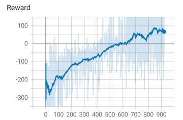
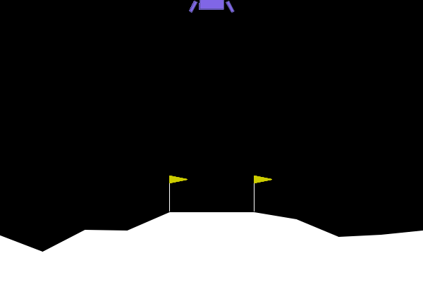
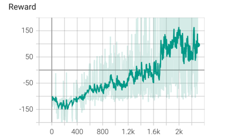

# PPO simple implementation

## What is this?

This is a simple implementation of PPO (Proximal Policy Optimization) algorithm.
The code is based on [OpenAI paper](https://arxiv.org/pdf/1707.06347.pdf).

## How to use

There are two different PPO : Continuous and Discrete.

### Continuous PPO

Continuous PPO is used for continuous action space (like BipedalWalker-v2 environement).
It handles MultiActions (like BipedalWalker-v2 environement).


### Discrete PPO

Discrete PPO is used for discrete action space (like LunarLander-v2 environement).
It doesn't handle MultiDiscrete (like LunarLander-v2 environement).

### Recurrent PPO

Recurrent PPO is used for environement with recurrent neural network (like Doom environement).
You have to use the LSTMActor and LSTMCritic classes.


For the moment, MultiDiscrete and MultiAction continuous are not implemented (I'm working on it).


Install the requirements:

```bash
pip install -r requirements.txt
```

Run the training:

```bash
python main.py
```

You can change the hyperparameters in main.py, and change the environement too.

## Results

### LunarLander-v2 (Discrete)

Here are the results for LunarLander-v2 environement (reward per episode):






### BipedalWalker-v2 (Continuous)

Here are the results for BipedalWalker-v2 environement (reward per episode):




